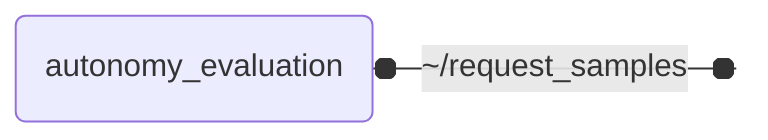

# `autonomy_evaluation`

Metrics-based evaluation of automated driving modules, generating the evidence for benchmarking automated driving deployments

`autonomy_evaluation` is the part of the **Autonomy.Benchmarks** suite that turns the output of a system under test into
metrics. It evaluates the samples that [autonomy_datasets](https://github.com/thinking-cars/autonomy_datasets) replays
against the labels of the dataset, and reports the metrics per scene and over all evaluated samples, as one part of the evidence
an automated driving deployment is benchmarked on.

## Nodes

### `autonomy_evaluation`

The node runs the evaluation selected by `evaluation`, either one of this package by its name or one implemented in another package as `<module>:<class>` (see [Adding more Evaluations](../docs/IMPLEMENTATION.md#adding-more-evaluations)). Each evaluation declares the topics it reads: its _inputs_ from the system under test, and, if it compares them with a reference, its _ground truth_. The node subscribes to all of them, each on its node-relative name, which the launch file remaps onto the topic given by the launch argument of the same name, e.g. `prediction:=/object_list/prediction`. A topic without such an argument is subscribed in the private namespace of the node. The node logs which topic it evaluates as input and which as ground truth. A topic an evaluation declares as optional, e.g. meta information that not every dataset publishes, is only waited for while it has a publisher; otherwise, the samples are evaluated without it.

| Evaluation | Inputs | Ground truth |
| --- | --- | --- |
| `object_detection_3d` | `prediction` (`perception_msgs/ObjectList`) | `label` (`perception_msgs/ObjectList`); optionally `label_meta_info` (`autonomy_datasets_msgs/ObjectListMetaInfo`, subscribed next to `label` on `<label topic>/meta_info`) |

The messages of all topics that belong to the same sample are matched by their stamp and evaluated together. By default, only messages with exactly the same stamp are matched, as the dataset stamps all messages of a sample with its recording time and a system under test stamps its output with the stamp of the input it processed. Set `sync_tolerance` to match topics whose stamps differ, e.g. those a simulation publishes at slightly different times or at different rates. A message without a header, e.g. a `std_msgs/Bool`, is stamped with the time it is received at.

With `sample_source` set to `dataset`, the default, the node requests the samples it evaluates from the dataset, using the `request_samples` service of [autonomy_datasets](https://github.com/thinking-cars/autonomy_datasets), which publishes them and responds once they have been published. By default one sample is requested at a time, so the dataset only publishes the next sample once the system under test has delivered its output for the current one and the node has evaluated it. Increase `samples_per_request` to publish samples in batches, set it to `0` to publish the whole dataset with a single request, or list the IDs of individual samples in `sample_ids` to evaluate only those.

Once the dataset reports that all requested samples have been published, or its node has shut down after publishing its last sample, the per-sample metrics are aggregated over all evaluated samples (`metrics`) and for the samples of each scene the dataset published them from (`scenes`, matched with the samples via the `published_scene_ids` of the responses). The metrics are logged, and written to a JSON file if `results_path` is set. Samples that are not evaluated within `evaluation_timeout` seconds of being published, e.g. because the system under test skipped them, are left out.

```bash
ros2 launch autonomy_evaluation autonomy_evaluation.launch.py \
  prediction:=/object_list/prediction \
  label:=/object_list/lidar_01 \
  request_samples:=/datasets/request_samples \
  results_path:=/results/object_detection_3d.json
```

With `sample_source` set to `external`, the node requests no samples itself and evaluates every sample that others publish, e.g. a closed-loop simulation, a live system, or the dataset stepped through with the [playback panel](https://github.com/thinking-cars/autonomy_datasets/blob/main/autonomy_datasets_rviz_plugins/README.md) in RViz, whose _Service_ field has to name the `request_samples` service of the dataset node (`/datasets/request_samples` by default). `samples_per_request`, `sample_ids` and `evaluation_timeout` then have no effect. As the node receives no responses of a dataset, it neither learns the scenes of the samples, so `scenes` stays empty, nor when publishing has ended: the results of the evaluated samples are reported once the node is stopped, e.g. with Ctrl-C, and are marked as incomplete.

```bash
# look at the samples of a dataset one by one, stepping through them in RViz
ros2 launch autonomy_evaluation autonomy_evaluation.launch.py \
  prediction:=/object_list/prediction \
  label:=/object_list/lidar_01 \
  visualize:=true \
  sample_source:=external

# evaluate a closed-loop planner with an evaluation of another package, which reads inputs only
ros2 launch autonomy_evaluation autonomy_evaluation.launch.py \
  evaluation:=my_planner_evaluations.time_to_collision:TimeToCollision \
  ego_data:=/ego_data \
  objects:=/simulation/objects \
  sample_source:=external \
  sync_tolerance:=0.05 \
  results_path:=/results/time_to_collision.json
```



#### Service Clients

| Service | Type | Description |
| --- | --- | --- |
| `~/request_samples` | `autonomy_datasets_msgs/srv/RequestSamples` | request samples from dataset |

#### Parameters

| Parameter | Type | Default | Description |
| --- | --- | --- | --- |
| `evaluation` | `string` | `object_detection_3d` | name of an evaluation of this package, or '<module>:<class>' of an evaluation implemented in another package |
| `visualize` | `bool` | `false` | publish the per-sample visualization of the evaluation for RViz, e.g. the true positives, false positives and false negatives of an object detection |
| `sample_source` | `string` | `dataset` | 'dataset' requests the samples to evaluate from the dataset one after another; 'external' evaluates the samples published by others, e.g. by a simulation, a live system or the playback panel in RViz, and reports the results once the node is stopped |
| `sync_tolerance` | `float` | `0.0` | seconds by which the stamps of the messages of a sample may differ; 0 only matches messages with exactly the same stamp, as the dataset and a system under test echoing its stamps publish them |
| `samples_per_request` | `int` | `1` | number of samples to request from the dataset at a time; 0 requests all remaining samples at once, 1 evaluates every sample before the next one is published |
| `sample_ids` | `string` | - | comma-separated IDs of the dataset samples to evaluate (e.g. '0,10,20'); if empty, all samples of the dataset are evaluated |
| `evaluation_timeout` | `float` | `60.0` | seconds to wait for a published sample to be evaluated before continuing without it |
| `results_path` | `string` | - | path of the JSON file the evaluation results are written to; results are only logged if empty |

## Launch Files

### [`autonomy_evaluation.launch.py`](launch/autonomy_evaluation.launch.py)

| Argument | Default | Description |
| --- | --- | --- |
| `request_samples` | `"~/request_samples"` | service of the dataset node used to request the samples to evaluate |
| `evaluation` | `"object_detection_3d"` | evaluation to run |
| `name` | `"autonomy_evaluation"` | node name |
| `namespace` | `""` | node namespace |
| `log_level` | `"info"` | ros logging level |
| `use_sim_time` | `"true"` | use sim time |
| `visualize` | `"false"` | publish the per-sample true positives, false positives and false negatives and open RViz |
| `sample_source` | `"dataset"` | 'dataset' requests the samples to evaluate from the dataset one after another; 'external' evaluates the samples published by others, e.g. by a simulation or the playback panel in RViz |
| `sync_tolerance` | `"0.0"` | seconds by which the stamps of the messages of a sample may differ (0 matches exact stamps only) |
| `samples_per_request` | `"1"` | number of samples to request from the dataset at a time (0 requests all remaining samples at once) |
| `sample_ids` | `""` | comma-separated IDs of the dataset samples to evaluate (all samples if empty) |
| `evaluation_timeout` | `"60.0"` | seconds to wait for a published sample to be evaluated before continuing without it |
| `results_path` | `""` | path of the JSON file the evaluation results are written to (results are only logged if empty) |
