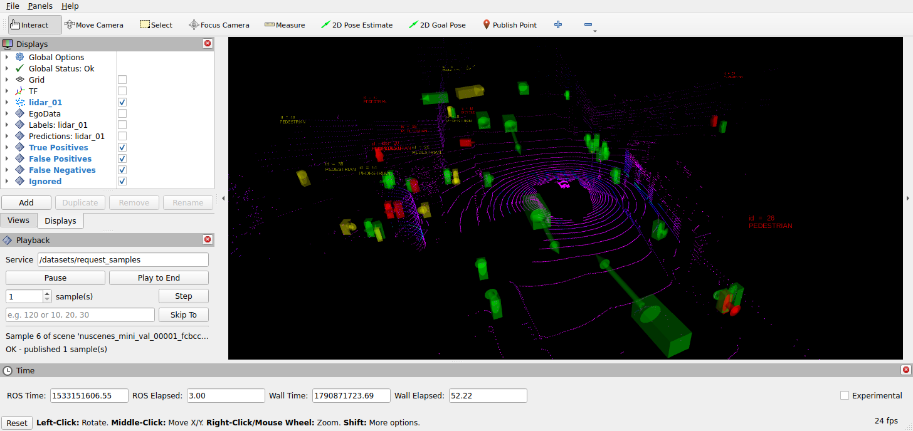

# Implementation Details

This repository supports the following evaluations of automated driving systems:

- [3D Object Detection](#3d-object-detection): 3D bounding-box object detection on the classes of `perception_msgs/ObjectClassification`

### 3D Object Detection



Evaluates 3D bounding boxes, e.g. detected in lidar point clouds, camera images or both, against the labels of a dataset. Predictions and labels are compared on the classes of [`perception_msgs/ObjectClassification`](https://github.com/ika-rwth-aachen/perception_interfaces/blob/main/perception_msgs/msg/ObjectClassification.msg), so a model can be evaluated on datasets of different class taxonomies. The metrics follow the [nuScenes detection benchmark](https://www.nuscenes.org/object-detection), which serves as reference; the evaluation is no implementation of the official nuScenes challenge and deviates from it as listed [below](#deviations-from-the-nuscenes-reference).

**Supported datasets:** every dataset of [autonomy_datasets](https://github.com/thinking-cars/autonomy_datasets) that publishes 3D object labels:

- [Waymo Open Dataset](https://github.com/thinking-cars/autonomy_datasets/blob/main/docs/IMPLEMENTATION.md#waymo-open-dataset)
- [nuScenes](https://github.com/thinking-cars/autonomy_datasets/blob/main/docs/IMPLEMENTATION.md#nuscenes-dataset)
- [MAN TruckScenes](https://github.com/thinking-cars/autonomy_datasets/blob/main/docs/IMPLEMENTATION.md#man-truckscenes-dataset)
- [NVIDIA PhysicalAI AV Dataset](https://github.com/thinking-cars/autonomy_datasets/blob/main/docs/IMPLEMENTATION.md#nvidia-physicalai-av-dataset)
- [DrivIng](https://github.com/thinking-cars/autonomy_datasets/blob/main/docs/IMPLEMENTATION.md#driving-dataset)
- [TUM Traffic](https://github.com/thinking-cars/autonomy_datasets/blob/main/docs/IMPLEMENTATION.md#tum-traffic-dataset)
- [Zenseact Open Dataset](https://github.com/thinking-cars/autonomy_datasets/blob/main/docs/IMPLEMENTATION.md#zenseact-open-dataset)
- [FZI-AURA](https://github.com/thinking-cars/autonomy_datasets/blob/main/docs/IMPLEMENTATION.md#fzi-aura-dataset)

| Topic | Type | Description |
| --- | --- | --- |
| `prediction` | `perception_msgs/ObjectList` | 3D objects detected by the system under test |
| `label` | `perception_msgs/ObjectList` | 3D object labels of the dataset; predictions in another frame are transformed into the frame of the labels with the transforms published on `/tf` and `/tf_static` |
| `label_meta_info` (optional) | `autonomy_datasets_msgs/ObjectListMetaInfo` | dataset annotations of the labels, subscribed next to `label` on `<label topic>/meta_info`; only read to recognize bike racks. Samples of a dataset that publishes no meta information are evaluated without it |

Metrics are computed based on the following assumptions:

- **Classes**: the evaluated classes are the classes of `perception_msgs/ObjectClassification`: `pedestrian`, `bicycle`, `motorcycle`, `car`, `utility`, `bus`, `animal`, `vru` and `micro`.
  - The classes of an object are the classes of its classifications that share the highest probability. A dataset that cannot tell which class an object has assigns all its possible classes with the same probability, e.g. Waymo a vehicle as `car`, `motorcycle`, `utility`, `bus` and `micro`. A detection usually has a single most probable class.
  - classes the message does not define, e.g. Waymo's signs, are evaluated as `UNKNOWN`.
  - `UNKNOWN` (definitely none of the defined classes) and `UNCLASSIFIED` (unknown classification, i.e. any class) are never evaluated. Predictions of neither evaluated class, e.g. barriers and traffic cones of a nuScenes-trained detector, are dropped.
- **Compatibility**: a prediction may only match a label if all its classes are possible classes of the label, e.g. a `utility` prediction matches a Waymo vehicle but not a nuScenes car. An `UNCLASSIFIED` label may be any class.
- **Positive and don't-care labels**: a label whose possible classes are all evaluated counts exactly once, as true positive or false negative. A label that may also be `UNKNOWN` or `UNCLASSIFIED` is a don't-care object: a prediction matched to it is ignored, and it is never a false negative. A label that can only be `UNKNOWN`, e.g. a nuScenes barrier, is matched by no prediction, so a `car` predicted on it is a false positive.
- **Evaluated classes**: classes that the labels of a dataset do not distinguish are evaluated together, as one class named after its members joined by `|`. All possible classes of a positive label end up in the same evaluated class, and the evaluated classes are derived from the labels of all evaluated samples, so the results of each scene use the same classes as the results of all samples. Each label and each detection of a single class therefore counts for exactly one evaluated class.

  <details>
  <summary>Evaluated classes per dataset</summary>

  | Dataset | Evaluated classes |
  | --- | --- |
  | nuScenes, MAN TruckScenes, Zenseact Open Dataset, FZI-AURA, DrivIng, TUM Traffic | one per class, e.g. `car`, `utility` (trucks, trailers, construction and emergency vehicles), `bus`, `pedestrian`, `bicycle`, `motorcycle`, `vru` (strollers, wheelchairs), `micro` (personal mobility), `animal` |
  | Waymo Open Dataset | `motorcycle\|car\|utility\|bus\|micro` (vehicles), `pedestrian\|vru` (pedestrians), `bicycle` (cyclists); its unknown objects, labeled `UNKNOWN` or `ANIMAL`, are don't-care |
  | NVIDIA PhysicalAI AV Dataset | `car`, `utility`, `bus`, `pedestrian\|vru` (persons and strollers), `bicycle\|motorcycle` (riders), `animal`; its other vehicles, labeled `UNKNOWN` or `MOTORCYCLE`, are don't-care |

  Objects that Zenseact Open Dataset flags as unclear and FZI-AURA objects of unknown categories are `UNCLASSIFIED`, hence don't-care. A dataset should only list several possible classes for objects whose class it systematically cannot tell, since a single such label joins its classes for the whole evaluation.

  </details>

- **Matching**: predictions, highest confidence first, each claim the nearest unclaimed compatible label whose 2D center distance on the ground plane is below the threshold of `{0.5, 1.0, 2.0, 4.0} meters`; of equally distant labels, positive ones are claimed first. For labels of a single class, this is the per-class matching of nuScenes. A true positive belongs to the evaluated class of its label, a false positive counts against the evaluated class of each of its classes.
- **Detection range**: labels and predictions are only considered within the range of their classes. An object of several possible classes uses the largest of their ranges, an `UNCLASSIFIED` label the largest of all.

  <details>
  <summary>Per-class detection range</summary>

  - Car, Utility, Bus: `< 50 m`
  - Pedestrian, Bicycle, Motorcycle: `< 40 m`
  - VRU, Micro, Animal: `< 40 m` (not evaluated by nuScenes, ranged like pedestrians)

  </details>

- **Bike racks**: bicycles and motorcycles are removed from predictions and labels if their center falls inside the footprint of a bike rack. Bike racks are recognized by their `original_class` (`static_object.bicycle_rack`) in the optional label meta information, as published for nuScenes and MAN TruckScenes.
- **Average precision**: for each match threshold, the average precision (`ap`) is calculated by integrating the recall-precision curve for recalls **and** precisions `> 0.1` (points at or below either threshold are excluded). The mean average precision (mAP) is the average over match thresholds and evaluated classes with labels; an evaluated class without labels has no AP, so its predictions do not dilute the mAP. Evaluated classes with labels that the model never predicts count with AP 0.
- **True positive metrics** (`ate`, ...) are calculated using a match threshold of `2.0 m`. The velocity error `ave` is only computed against labels whose velocity is set: `perception_msgs` marks a state entry that is not set with `CONTINUOUS_STATE_COVARIANCE_INVALID` on the diagonal of the state covariance. Without any label with velocity, `ave` is unavailable.
- **Detection score**: `(5·mAP + Σ max(1−m{metric},0)) / (5 + number of TP metrics)` over the available TP metrics `ate`, `ase`, `aoe` and `ave`, i.e. the formula of the nuScenes detection score (NDS) without the attribute error.

#### Deviations from the nuScenes reference

- **Classes**: the classes of `perception_msgs/ObjectClassification` replace the 10 nuScenes detection classes, e.g. trucks, trailers and construction vehicles are evaluated together as `utility`, barriers and traffic cones are not evaluated, and strollers, wheelchairs, personal mobility devices, animals and emergency vehicles are. Classes without labels in the evaluated samples are skipped instead of entering the mean with AP 0.
- **Attributes**: `perception_msgs/Object` cannot carry attributes, so the attribute error `aae` is not evaluated and the detection score is not comparable to the official NDS.
- **Velocities**: as nuScenes skips labels whose velocity cannot be determined, the velocity error skips labels whose velocity is not marked as set in their state covariance. Without any such label, `ave` is left out of the detection score instead of counting as error 1.
- **Label filters**: the evaluation does not filter labels by their number of points. autonomy_datasets publishes lidar labels with at least `min_lidar_points_in_bbox` lidar points (default `1`), so labels that only radar points fall into are missing. Bike racks are only known if their labels are published, and their footprint is checked in 2D.
- **Ranges** are measured from the origin of the frame the labels are given in, e.g. the lidar, instead of the ego vehicle.
- **TP errors** are interpolated over the recall of all predictions instead of over their confidence.
- The number of predictions per sample is not limited.

<details>
<summary>Output metrics</summary>

The results hold the `metrics` over all evaluated samples and, under `scenes`, the `num_samples`, `sample_ids` and `metrics` of each scene. Each metric holds its aggregated value under `_value_`, next to its sub-metrics per match threshold or per evaluated class `{class}`, e.g. `car` or `pedestrian|vru`.

| Metric | Description |
| - | - |
| `_value_` | Detection score combining the mAP and the available mean TP errors with weights 5-1-1-1-1, normalised by the sum of the weights: `(5·mAP + Σ max(1−mTP,0)) / (5 + number of TP errors)`, `null` without labels. |
| `num_labels._value_` | Number of positive labels, i.e. without don't-care labels. |
| `num_labels.{class}._value_` | Number of positive labels of the class, for every evaluated class with labels or predictions. A class with predictions but `0` labels has no AP and TP errors, so its predictions do not enter the metrics. |
| `num_labels.{class}.{classes}` | Number of positive labels of the class by their possible classes `{classes}`, joined by `\|`, e.g. NVIDIA's persons as `pedestrian\|vru` and its strollers as `vru` within `pedestrian\|vru`. |
| `num_predictions._value_` | Number of predictions of an evaluated class. |
| `num_predictions.{class}` | Number of predictions of the class, for every evaluated class with labels or predictions; a prediction of classes of several evaluated classes counts for each of them. A class with labels but `0` predictions counts with AP 0. |
| `ap._value_` | Mean average precision over all match distance thresholds and all evaluated classes with labels, `null` without labels. |
| `ap.classes.{class}` | Mean average precision of the class over all match distance thresholds. |
| `ap.dist_{threshold}._value_` | Mean average precision over all evaluated classes with labels, with a maximum match distance of `{threshold}` meters (`0.5`, `1.0`, `2.0`, `4.0`). |
| `ap.dist_{threshold}.classes.{class}` | Average precision of the class with a maximum match distance of `{threshold}` meters. |
| `ate._value_`, `ate.{class}` | Average translation error as Euclidean distance in meters, mean over the evaluated classes with labels and per class. |
| `ase._value_`, `ase.{class}` | Average scale error as `1 - IoU` after aligning centers and orientation. |
| `aoe._value_`, `aoe.{class}` | Average orientation error as smallest yaw angle difference between prediction and ground truth in radians. |
| `ave._value_`, `ave.{class}` | Average velocity error as absolute velocity error in `m/s`, `null` for a class without labels with velocity and as mean if no label has a velocity. |

The TP errors are measured with a maximum match distance of 2 meters; their means skip `null` classes.

</details>

### Adding more Evaluations

An evaluation declares the topics it reads and computes metrics from their messages. It may read the topics of the system under test only, e.g. the ego state and the surrounding objects to evaluate a closed-loop planner by its time to collision, or compare them with ground truth, e.g. the predictions of a perception algorithm with the labels of a dataset. The node subscribes to all declared topics, matches their messages into samples by their stamp, and passes the messages of each sample by the names of their topics.

To contribute a new evaluation for a dataset or evaluation protocol:

1. Create a new evaluation class in [autonomy_evaluation/evaluations/](../autonomy_evaluation/autonomy_evaluation/evaluations/) that inherits from `Evaluation`.
2. Declare the topics it reads, each by the name it is configured with, e.g. `prediction:=/topic`, mapped to its ROS message type:
   - `required_inputs()`: the topics of the system under test that are evaluated (required).
   - `required_ground_truth()`: the reference the inputs are compared with, e.g. dataset labels (optional, none by default).
   - `optional_ground_truth()`: ground truth that enriches the evaluation without being necessary for it, e.g. dataset annotations that not every dataset publishes (optional, none by default). A sample only waits for its message while its topic has a publisher; otherwise, the message is passed as `None`.
   - `derived_topics()`: topics published next to another one, e.g. meta information on `<label topic>/meta_info`, which follow that topic instead of being configured on their own (optional).
3. Implement `compute_sample_metrics()`, whose parameters are named after the declared topics, and `compute_aggregated_metrics()`. Optionally, implement `visualization_outputs()` and `visualize_sample()` to publish a per-sample visualization for RViz.
4. Configure the evaluation in `__init__` (thresholds, per-class ranges, and metric rules as instance attributes); keep static lookup tables (e.g. class names) as module-level `_CONSTANT_NAME` constants.
5. Register the evaluation in `EVALUATIONS` of [registry.py](../autonomy_evaluation/autonomy_evaluation/evaluations/registry.py) so it can be selected via the `evaluation:=<name>` launch argument, add comprehensive tests in [tests/evaluations/](../autonomy_evaluation/tests/evaluations/) following existing test patterns, and update the documentation with evaluation details, metrics table, dataset requirements, and the topics it reads.
6. Create a [Pull Request](https://github.com/thinking-cars/autonomy_evaluation/pulls) on GitHub and wait for maintainer feedback.

An evaluation that is specific to a system under test can also stay in a package of its own. The node loads it by its module and class, e.g. `evaluation:=my_package.evaluations:TimeToCollision`, as long as the module is importable in the environment of the node:

```python
from typing import Any, Dict, List, Optional

from autonomy_evaluation.evaluations import Evaluation
from perception_msgs.msg import EgoData, ObjectList


class TimeToCollision(Evaluation):
    def __init__(self) -> None:
        super().__init__(name="time_to_collision", description="time to collision of a closed-loop planner")

    def required_inputs(self) -> Dict[str, Any]:
        # inputs only: the metric needs no ground truth
        return {"ego_data": EgoData, "objects": ObjectList}

    def compute_sample_metrics(self, ego_data: EgoData, objects: ObjectList, sample_id: Optional[str] = None) -> Dict[str, Any]:
        return {"ttc": ...}

    def compute_aggregated_metrics(self, sample_results: List[Dict[str, Any]]) -> Dict[str, Any]:
        return {"min_ttc": min(entry["metrics"]["ttc"] for entry in sample_results)}
```
